<picture>
  <source media="(prefers-color-scheme: dark)" srcset="./assets/chat-dark.svg" />
  
</picture>

<a href="https://swachhvan.vercel.app/"><picture><source media="(prefers-color-scheme: dark)" srcset="./assets/card-swachhvan-dark.svg" /></picture></a>
<a href="https://github.com/tanmayai23/Hey-Dude-Voice-Assistant"><picture><source media="(prefers-color-scheme: dark)" srcset="./assets/card-heydude-dark.svg" /></picture></a>
<a href="https://github.com/tanmayai23/CALL-E-Hackathon"><picture><source media="(prefers-color-scheme: dark)" srcset="./assets/card-marketbuddy-dark.svg" /></picture></a>
<a href="https://github.com/tanmayai23/gtsrb-traffic-sign-recognition"><picture><source media="(prefers-color-scheme: dark)" srcset="./assets/card-gtsrb-dark.svg" /></picture></a>

  also shipped →
  <a href="https://aitravelassist.vercel.app">AI Travel Assist</a> ·
  <a href="https://whisper-ai-transcription.vercel.app">Whisper Transcribe</a> ·
  <a href="https://vibehub-liard.vercel.app">VibeHub</a> ·
  <a href="https://github.com/tanmayai23?tab=repositories">all repos</a>

<picture>
  <source media="(prefers-color-scheme: dark)" srcset="./assets/chat-more-dark.svg" />
  
</picture>

<picture>
  <source media="(prefers-color-scheme: dark)" srcset="./assets/chat-end-dark.svg" />
  
</picture>

<h3 align="center">Open to connect</h3>

  &nbsp;&nbsp;
  &nbsp;&nbsp;
  &nbsp;&nbsp;
  &nbsp;&nbsp;
  &nbsp;&nbsp;
  

