


 

 



  



  


<a href="https://swachhvan.vercel.app/"></a>
<a href="https://github.com/tanmayai23/Hey-Dude-Voice-Assistant"></a>
<a href="https://github.com/tanmayai23/CALL-E-Hackathon"></a>
<a href="https://github.com/tanmayai23/gtsrb-traffic-sign-recognition"></a>
<a href="https://aitravelassist.vercel.app"></a>
<a href="https://whisper-ai-transcription.vercel.app"></a>

<b>Live:</b>
<a href="https://swachhvan.vercel.app/">SwachhVan</a> ·
<a href="https://hey-dude-voice-assistant.vercel.app">Hey Dude</a> ·
<a href="https://aitravelassist.vercel.app">Travel Assist</a> ·
<a href="https://whisper-ai-transcription.vercel.app">Whisper</a> ·
<a href="https://vibehub-liard.vercel.app">VibeHub</a>
&nbsp;&nbsp;|&nbsp;&nbsp;
<b>Code:</b>
<a href="https://github.com/tanmayai23/Hey-Dude-Voice-Assistant">Hey Dude</a> ·
<a href="https://github.com/tanmayai23/CALL-E-Hackathon">Market Buddy</a> ·
<a href="https://github.com/tanmayai23/gtsrb-traffic-sign-recognition">TrafficSignNet</a> ·
<a href="https://github.com/tanmayai23/AI-Travel-Assist">Travel Assist</a> ·
<a href="https://github.com/tanmayai23/Whisper_AI_Transcription">Whisper</a>

 


| Project | What it does | Built with |
| :-- | :-- | :-- |
| [**VibeHub**](https://github.com/tanmayai23/vibehub-campus-connect) · [live](https://vibehub-liard.vercel.app) | Student super-app (courses, attendance, mood, community) with an NLP chatbot that handles 100+ query types. Placed at Summer of Codefest '25 | TypeScript · NLP |
| [**Customer Churn ML**](https://github.com/tanmayai23/customer-churn-ml-api-explainability) | End-to-end churn classifier: preprocessing, cross-validation, LogReg vs Random Forest, ROC-AUC | scikit-learn · pandas |
| [**Fairness & Explainability**](https://github.com/tanmayai23/Fairness-Bias-Explainability) | SHAP global/local explanations, group fairness metrics, bias-gap analysis and mitigation plan | SHAP · Jupyter |
| [**API Docker Deployment**](https://github.com/tanmayai23/API-Docker-Deployment) | Packaging ML models as containerised, production-style APIs | Python · Docker |
| [**NEXUS Calculator**](https://github.com/tanmayai23/NEXUS-CALCULATOR) | Advanced math problem solver | TypeScript |
| [**Machine Learning Projects**](https://github.com/tanmayai23/Machine-Learning-Projects) | Collection of classic ML experiments | Python |

 


 

  


  



  


 

 

  

  
<picture>
  <source media="(prefers-color-scheme: dark)" srcset="https://raw.githubusercontent.com/tanmayai23/tanmayai23/output/snake-dark.svg" />
  
</picture>

 

 
&nbsp;&nbsp;
&nbsp;&nbsp;
&nbsp;&nbsp;
&nbsp;&nbsp;

  

