<a href="https://portfolio-five-topaz-l2jyqjtlet.vercel.app">
  <picture>
    <source media="(prefers-color-scheme: dark)" srcset="./assets/hero-dark.svg" />
    
  </picture>
</a>

  <a href="https://www.linkedin.com/in/tanmay-kala/"><b>LinkedIn</b></a>&nbsp;&nbsp;·&nbsp;&nbsp;
  <a href="mailto:tanmaykala171206@gmail.com"><b>Email</b></a>&nbsp;&nbsp;·&nbsp;&nbsp;
  <a href="https://portfolio-five-topaz-l2jyqjtlet.vercel.app"><b>Portfolio</b></a>&nbsp;&nbsp;·&nbsp;&nbsp;
  <a href="https://swachhvan.vercel.app/"><b>Live demo</b></a>

<picture>
  <source media="(prefers-color-scheme: dark)" srcset="./assets/bento-dark.svg" />
  
</picture>

  

<a href="https://swachhvan.vercel.app/"><picture><source media="(prefers-color-scheme: dark)" srcset="./assets/card-swachhvan-dark.svg" /></picture></a>
<a href="https://github.com/tanmayai23/Hey-Dude-Voice-Assistant"><picture><source media="(prefers-color-scheme: dark)" srcset="./assets/card-heydude-dark.svg" /></picture></a>
<a href="https://github.com/tanmayai23/CALL-E-Hackathon"><picture><source media="(prefers-color-scheme: dark)" srcset="./assets/card-marketbuddy-dark.svg" /></picture></a>
<a href="https://github.com/tanmayai23/gtsrb-traffic-sign-recognition"><picture><source media="(prefers-color-scheme: dark)" srcset="./assets/card-gtsrb-dark.svg" /></picture></a>

  more →
  <a href="https://aitravelassist.vercel.app">AI Travel Assist</a> ·
  <a href="https://whisper-ai-transcription.vercel.app">Whisper Transcribe</a> ·
  <a href="https://vibehub-liard.vercel.app">VibeHub</a> ·
  <a href="https://github.com/tanmayai23?tab=repositories">all repos</a>

 

<picture>
  <source media="(prefers-color-scheme: dark)" srcset="https://raw.githubusercontent.com/tanmayai23/tanmayai23/output/snake-dark.svg" />
  
</picture>
