<picture>
  <source media="(prefers-color-scheme: dark)" srcset="./assets/ghost-protocol-dark.svg">
  
</picture>

 

---

### `00 / THE BRIEF`

# I build AI that leaves the demo stage.

I'm **Tanmay Kala** — a Generative AI and NLP engineer, Computer Science student at VIT Bhopal, and founder of **NAXATRA AI**.

I work at the intersection of applied AI and product engineering: turning models, data, and APIs into tools people can actually use. My long-term direction is to help make useful AI infrastructure more accessible to builders across **Bharat**.

> **Operating principle:** Ideas are cheap. Useful systems, shipped and measured, are the work.

- **Building:** AI products, LLM workflows, voice interfaces, and applied ML systems.
- **Exploring:** RAG, model evaluation, fine-tuning, NLP, and production-minded AI engineering.
- **Founder lens:** Start with a real problem, validate the workflow, then build the smallest useful system.
- **Open to:** AI/ML and Generative AI internships, serious collaborators, and technically ambitious projects.

---

### `01 / SELECTED OPERATIONS`

<picture>
  <source media="(prefers-color-scheme: dark)" srcset="./assets/project-swachhvan-dark.svg">
  
</picture>

  <a href="https://swachhvan.vercel.app/"><strong>OPEN LIVE PRODUCT ↗</strong></a>

<table>
  <tr>
    <td width="50%" valign="top">
      <h3>01. Hey Dude</h3>
      
<strong>Voice-first desktop assistant</strong>

      Voice interaction, Gemini-powered conversation, face recognition, hotword detection, and desktop automation.
        
      Python · Gemini · OpenCV · SQLite
        
      <a href="https://github.com/tanmayai23/Hey-Dude-Voice-Assistant">Inspect the repository ↗</a>
    </td>
    <td width="50%" valign="top">
      <h3>02. Market Buddy / CALL-E</h3>
      
<strong>Autonomous voice-agent experience</strong>

      A hackathon build focused on conversational workflows and dependable behavior, with 421 passing tests reported for the project.
        
      Agents · TypeScript · Testing
        
      <a href="https://github.com/tanmayai23/CALL-E-Hackathon">Inspect the repository ↗</a>
    </td>
  </tr>
  <tr>
    <td width="50%" valign="top">
      <h3>03. TrafficSignNet</h3>
      
<strong>Computer vision classification</strong>

      CNN-based traffic-sign recognition across 43 classes, with 96.82% accuracy reported for the model.
        
      Python · CNN · Computer Vision
        
      <a href="https://github.com/tanmayai23/gtsrb-traffic-sign-recognition">Inspect the repository ↗</a>
    </td>
    <td width="50%" valign="top">
      <h3>04. Hey, where next?</h3>
      
<strong>AI Travel Assist</strong>

      Location-aware travel discovery designed to surface interesting places along a journey and help travelers decide what to explore.
        
      Python · Gemini API · Geolocation
        
      <a href="https://aitravelassist.vercel.app/">Open live product ↗</a>
    </td>
  </tr>
</table>

  <a href="https://whisper-ai-transcription.vercel.app/">Whisper Transcribe</a> ·
  <a href="https://vibehub-liard.vercel.app/">VibeHub</a> ·
  <a href="https://github.com/tanmayai23?tab=repositories">All repositories ↗</a>

---

### `02 / FIELD NOTES`

<table>
  <tr>
    <td align="center" width="33%">
      <h2>TOP 25</h2>
      Hack For Green Bharat
       among 400+ teams, as reported
    </td>
    <td align="center" width="33%">
      <h2>96.82%</h2>
      Traffic-sign CNN accuracy
       project-reported result
    </td>
    <td align="center" width="33%">
      <h2>421</h2>
      Passing tests
       CALL-E / Market Buddy project-reported result
    </td>
  </tr>
</table>

I care about outcomes that can be inspected: a deployed product, a reproducible experiment, a useful evaluation, a passing test suite, or a clear explanation of what failed and what changed.

---

### `03 / THE TOOLKIT`

  

  
  
  
  

My current focus is not collecting tools. It is learning where each tool fits, how to evaluate its output, and how to make the full system reliable.

---

### `04 / BUILD LOG`

<picture>
  <source media="(prefers-color-scheme: dark)" srcset="./assets/build-log-dark.svg">
  
</picture>

- **Problem first:** Define the user, constraint, and success metric before choosing a model.
- **Prototype fast:** Build the smallest end-to-end path that tests the core assumption.
- **Measure honestly:** Track latency, failure cases, quality, and cost—not just a happy-path demo.
- **Ship and iterate:** Document trade-offs and keep improving after the first deployment.

---

### `05 / THE HUMAN BEHIND THE SYSTEM`

I like ambitious problems, small teams with high ownership, and people who challenge assumptions with evidence. I don't believe every idea needs an AI model; I believe every system should earn its complexity.

**If you're building something consequential with AI, let's compare notes.**

  
  
  

  THE GHOST PROTOCOL · Stay curious. Build with intent. Leave evidence.

